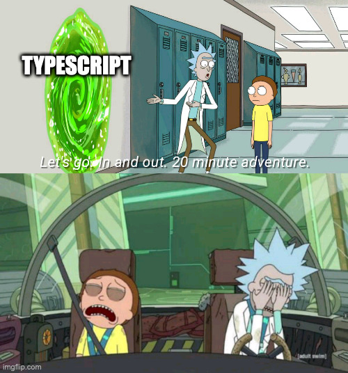
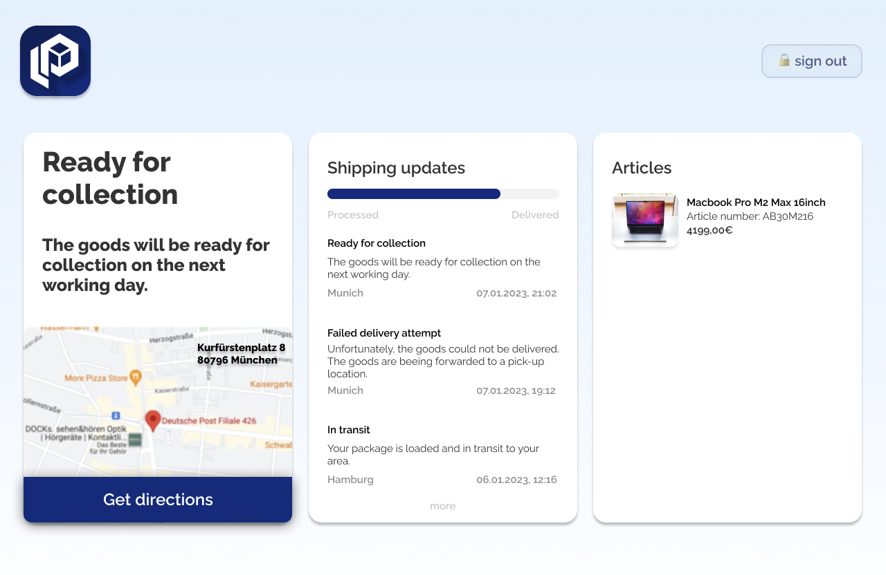
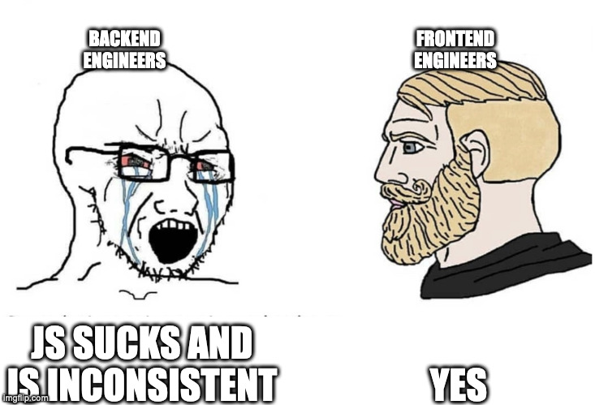

# parcelLab Frontend Engineer Quest

Welcome to the lost Repository of Frontend. You came a long way - join me around this campfire gif, make yourself a coffee and relax a bit - before you start your quest becoming a Frontend Engineer at parcelLab.
Take your time and read this Markdown parchment carefully, it will help you navigate around the dangers of this task.

## The Quest

At parcelLab we build tools that integrate with the worlds best online retailers and are used by millions of people - every day! That is why we are really into creating outstanding user experiences.

In this scenario, you are Frontend Engineer at parcelLab and you start working on a new project of building a web app that displays the order status and the shipping information for orders. Because your fellow backend developer colleague is late with his part (again 🙄) you will need to mock an api that returns one order from a list of orders ```orders.json``` based on the user's input and display it in a appealing way.  

The api that you mock will be (when finished) hosted on ```https://api.prcl.dev``` and the endpoints URL will look something like that: ```/orders/{{orderNumber}}?zip={{zipCode}}```. You can use a tool like e.g. [nock](https://github.com/nock/nock) for mocking the api.  

The app should have 2 views:
1. Sign In / User Input view - here the user can input an order number and a zip code (for verification - so that it is not possible to get access to order information without knowing the zip code of it) and a submit button. If the entered order number does not exist in the DB (orders.json) or the zip code does not match, you can show a error here as a notification or on a new page. Your choice.
2. Order View - after the user typed in a valid order number that exists in the DB, user will land on this page. It should view the order details and the shipping (in parcelLab lang "tracking") information.

This is how this could look like:





Remember these are only mockups. At parcelLab we expect from our frontend engineers to have a feeling for good UI/UX and give them the freedom of creation. You can design these views as you would like. (Also the map is just a bonus...) You can style it as you wish and make use of the data that you see in the order.json file!


## Our Expectations
You might be wondering after reading the scenario, how much effort and time we expect you to invest in this task. We know that you likely have a job, a life (I mean you are not a backend developer afterall), further open job applications and other things that require some of your valuable time. Therefore you should not spend more than 4 hours on this task.  

Just for you to have a understanding about the scope we expect, here a list for each level you might be applying for:

### Junior Developer:
- your application works without the need of modifications
- you use Javascript OR Typescript + React
- someone looking at the code knows what you tried to accomplish because you stick with the "Clean Code" principles

### Midlevel Developer:
- all of the above plus:
- you use Typescript
- your UI is looking clean
- you show your react hooks skills
- the code base is "Clean Code" by the book

### Senior Developer:
- all of the above plus:
- your UI is following best UX practices
- show us your Testing knowledge
- your Typescript have all the correct Typings and you do not use things like "any"

### Want to earn some bonus points:
- you care about accessibility



## Data Source
> ☝ Please do **not** edit the content of the file. It's up to you, how you want to mock the required api endpoint.

- [data/orders.json](./data/orders.json)

### orders.json
This file represents a subset of an orders DB with orders of different customers. Each order contains information that you  can use to display in the UI.  
> ⚠️ not all attributes can be filled with data - make sure to handle this scenario.

If you open the `orders.json` file you will see it contains multiple entries with following properties:

- `_id` - order id from the db
- `courier` - courier code that is delivering this order package
- `created` - db record creating date
- `updated` - db record last update date
- `updated` - db record last update date
- `checkpoints` - list of checkpoints from the shippment process - tip: can include a `meta` field with further information about the shippment status / location
- `delivery_info` - object with order detail data like recipient infos and `articles` list
- `delivery_info.announced_delivery_date` - first estimation of the delivery date made by the sender
- `destination_country_iso3` - 3 char code of the recpients country
- `zip_code` - zip code of the recipient - should be used in combindation with order number as verification


## What you will need
For setting up the web app you can just set up a standard React project (with e.g. CRA or any other tooling). You can use any module, design system or state management you like and structure the application in your favor.

You can simple clone this repository and send us a link to your fork.  

## In the end you should have
- [ ]  a mocked api endpoint so that you can create the data fetching logic
- [ ]  web app that has 2 or 3 views
    - [ ]  input / signin form
    - [ ]  order detail view
    - [ ]  error page - optional (depends how you want to display errors)


## What really makes us happy 😍
- [ ]  You provide us with a README.md that explains how we can run your app
- [ ]  Your code is well structured, clean and readable
- [ ]  You add comments and documentation, if your code isn't self-explanatory
- [ ]  You handle any common errors that could occur
- [ ]  You use automated tests where appropriate
